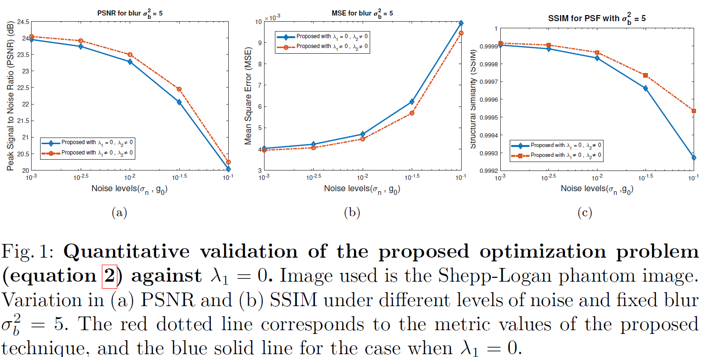

# A Proximal Approach to Image Deconvolution under Mixed Poisson-Gaussian Noise
[Hazique Aetesam](http://yulunzhang.com/), "A Proximal Approach to Image Deconvolution under Mixed Poisson-Gaussian Noise", NCVPRIPG, 2025 

<!-- [[paper](https://openreview.net/pdf?id=IloMJ5rqfnt)] [[arXiv](https://arxiv.org/abs/2210.01427)] [[supplementary material](https://openreview.net/attachment?id=IloMJ5rqfnt&name=supplementary_material)] [[visual results](https://drive.google.com/drive/folders/1b92XHwxuvBLOAiHAjWe-VFKN01hQUiO_?usp=sharing)] [[pretrained models](https://drive.google.com/drive/folders/1Sn1sl577Lwancj5SuQtRJk-GwUTRw7lK?usp=share_link)] -->

---
This code is the MATLAB implementation of our proposed Prox-PG model. Our Prox-PG model achieves **state-of-the-art** performance in image deconvolution under Poisson-Gaussian Noise against other competing methods
> **Abstract:** *Traditional image restoration methods, such as denoising and deconvolution, are designed to improve the spatial resolution of images that are blurred and noisy. Fluorescence microscopy is a field where images are particularly affected by blur—stemming from the microscope’s diffraction limit—and by both measurement and photon noise. As a result, these images can greatly benefit from advanced restoration techniques. In this work, we propose an image deconvolution approach specifically tailored to recover spatial detail in noisy and blurred fluorescence microscopy images. Our evaluation is carried out within a proximal iterative framework that explicitly models the mixed Poisson-Gaussian noise characteristic of these images. Specifically, we employ a variant of the Primal Dual Hybrid Gradient method to derive a closed-form solution to the associated optimization problem. We validate our approach through experiments on both synthetic and real fluorescence microscopy datasets, with both qualitative and quantitative results demonstrating the effectiveness of our proposed method. **Code Availability:** https://github.com/AetesamHazique/Prox-PG.git.*

<link rel="stylesheet" href="figures/bc.css">
<div class="c-compare" style="--value:50%;">
  
  
  <input
    type="range"
    class="c-compare__range"
    min="0"
    max="100"
    value="50"
    oninput="this.parentNode.style.setProperty('--value', `${this.value}%`)"
  />
</div>
  
## Requirements
- [MATLAB](https://matlab.mathworks.com/) (version>=2019)

### Installation
```bash
git clone https://github.com/AetesamHazique/Prox-PG.git
cd ART
```

## Contents

1. [Algorithm](#algo)
2. [Dataset](#dataset)
1. [Experimental Results](#Testing)
1. [Citation](#citation)
1. [Acknowledgement](#Acknowledgement)

---
## Algorithm
<p align="center">
> 
> </p>

## Datasets

Shepp Logan Phantom Image can be created from: https://in.mathworks.com/help/images/ref/phantom.html

Real Fluorescence Microscopy image available at: https://images.yeastrc.org/imagerepo/viewExperiment.do?id=9796

## Steps to Generate Point Spread Function (PSF) for Fluorescence Imaging

1. Install [ImageJ](https://imagej.net/ij/download.html) and [DeconvolutionLab](https://bigwww.epfl.ch/algorithms/psfgenerator/).
2. Add the jarfile associated with `DeconvolutionLab` in the `/plugins` folder of installed `ImageJ` 
3. Generate PSF using Born and Wolf Model. Parameters for PSF description (for example, image spatial dimension, number of 3D layers, excitation/emission wavelength, pixel size, numerical aperture of the objective lens) can be used from those given in real FM dataset link (given above). For every channel, the parameters may be different.
## Training
### Train on SR
1. Please download the corresponding training datasets and put them in the folder `datasets/DF2K`. Download the testing datasets and put them in the folder `datasets/SR`.
2. Follow the instructions below to begin training our ART model.
    ```bash
    # train ART for SR task, cropped input=64×64, 4 GPUs, batch size=8 per GPU
    python -m torch.distributed.launch --nproc_per_node=4 --master_port=2414 basicsr/train.py -opt options/train/train_ART_SR_x2.yml --launcher pytorch
    python -m torch.distributed.launch --nproc_per_node=4 --master_port=2414 basicsr/train.py -opt options/train/train_ART_SR_x3.yml --launcher pytorch
    python -m torch.distributed.launch --nproc_per_node=4 --master_port=2414 basicsr/train.py -opt options/train/train_ART_SR_x4.yml --launcher pytorch

    # train ART-S for SR task, cropped input=64×64, 4 GPUs, batch size=8 per GPU
    python -m torch.distributed.launch --nproc_per_node=4 --master_port=2414 basicsr/train.py -opt options/train/train_ART_S_SR_x2.yml --launcher pytorch
    python -m torch.distributed.launch --nproc_per_node=4 --master_port=2414 basicsr/train.py -opt options/train/train_ART_S_SR_x3.yml --launcher pytorch
    python -m torch.distributed.launch --nproc_per_node=4 --master_port=2414 basicsr/train.py -opt options/train/train_ART_S_SR_x4.yml --launcher pytorch
    ``` 
    Run the script then you can find the generated experimental logs in the folder `experiments`.

### Train on Gaussian Color Image Denoising
1. Please download the corresponding training datasets and put them in the folder `datasets/DFWB_RGB`. Download the testing datasets and put them in the folder `datasets/ColorDN`. 
2. Follow the instructions below to begin training our ART model.
    ```bash
    # train ART for ColorDN task, cropped input=128×128, 4 GPUs, batch size=2 per GPU
    python -m torch.distributed.launch --nproc_per_node=4 --master_port=2414 basicsr/train.py -opt options/train/train_ART_ColorDN_level15.yml --launcher pytorch
    python -m torch.distributed.launch --nproc_per_node=4 --master_port=2414 basicsr/train.py -opt options/train/train_ART_ColorDN_level25.yml --launcher pytorch
    python -m torch.distributed.launch --nproc_per_node=4 --master_port=2414 basicsr/train.py -opt options/train/train_ART_ColorDN_level50.yml --launcher pytorch
    ```
    Run the script then you can find the generated experimental logs in the folder `experiments`.


### Train on Real Image Denoising
1. Please download the corresponding training datasets and put them in the folder `datasets/SIDD`. Note that we provide both training and validating files, which are already processed.
2. Go to folder 'realDenoising'. Follow the instructions below to train our ART model.
    ```bash
    # go to the folder
    cd realDenoising
    # set the new environment (BasicSRv1.2.0), which is the same with Restormer for training.
    python setup.py develop --no_cuda_ext
    # train ART for RealDN task, 8 GPUs
    python -m torch.distributed.launch --nproc_per_node=8 --master_port=2414 basicsr/train.py -opt options/train_ART_RealDN.yml --launcher pytorch
    ```
    Run the script then you can find the generated experimental logs in the folder `realDenoising/experiments`.
3. Remember to go back to the original environment if you finish all the training or testing about real image denoising task. This is a friendly hint in order to prevent confusion in the training environment.
    ```bash
    # Tips here. Go back to the original environment (BasicSRv1.3.5) after finishing all the training or testing about real image denoising. 
    cd ..
    python setup.py develop
    ```

### Train on JPEG Compression Artifact Reduction
1. Please download the corresponding training datasets and put them in the folder `datasets/DFWB_CAR`. Download the testing datasets and put them in the folder `datasets/CAR`. 
2. Follow the instructions below to begin training our ART model.
    ```bash
    # train ART for CAR task, cropped input=126×126, 4 GPUs, batch size=2 per GPU
    python -m torch.distributed.launch --nproc_per_node=4 --master_port=2414 basicsr/train.py -opt options/train/train_ART_CAR_q10.yml --launcher pytorch
    python -m torch.distributed.launch --nproc_per_node=4 --master_port=2414 basicsr/train.py -opt options/train/train_ART_CAR_q30.yml --launcher pytorch
    python -m torch.distributed.launch --nproc_per_node=4 --master_port=2414 basicsr/train.py -opt options/train/train_ART_CAR_q40.yml --launcher pytorch
    ```
    Run the script then you can find the generated experimental logs in the folder `experiments`.

## Testing
### Test on SR
#### Test with ground-truth images
1. Please download the corresponding testing datasets and put them in the folder `datasets/SR`. Download the corresponding models and put them in the folder `experiments/pretrained_models`. 
2. Follow the instructions below to begin testing our ART model.
    ```bash
    # test ART model for image SR. You can find corresponding results in Table 2 of the main paper.
    python basicsr/test.py -opt options/test/test_ART_SR_x2.yml
    python basicsr/test.py -opt options/test/test_ART_SR_x3.yml
    python basicsr/test.py -opt options/test/test_ART_SR_x4.yml
    # test ART-S model for image SR. You can find corresponding results in Table 2 of the main paper.
    python basicsr/test.py -opt options/test/test_ART_S_SR_x2.yml
    python basicsr/test.py -opt options/test/test_ART_S_SR_x3.yml
    python basicsr/test.py -opt options/test/test_ART_S_SR_x4.yml
    ``` 
#### Test without ground-truth images
1. Please upload the images that need to be upscaled, and put them in the folder `datasets/example`. Download the corresponding models and put them in the folder `experiments/pretrained_models`. 
2. Choose the upscale size and follow the instructions below to apply our ART model to upscale the provided images.
    ```bash
    # apply ART model for image SR.
    python basicsr/test.py -opt options/apply/test_ART_SR_x2_without_groundTruth.yml
    python basicsr/test.py -opt options/apply/test_ART_SR_x3_without_groundTruth.yml
    python basicsr/test.py -opt options/apply/test_ART_SR_x4_without_groundTruth.yml
    ``` 
    Run the script then you can find the output visual results in the automatically generated folder `results`.

### Test on Gaussian Color Image Denoising
1.  Please download the corresponding testing datasets and put them in the folder `datasets/ColorDN`. Download the corresponding models and put them in the folder `experiments/pretrained_models`. 
2. Follow the instructions below to begin testing our ART model.
    ```bash
    # test ART model for Color Image Denoising. You can find corresponding results in Table 4 of the main paper.
    python basicsr/test.py -opt options/test/test_ART_ColorDN_level15.yml
    python basicsr/test.py -opt options/test/test_ART_ColorDN_level25.yml
    python basicsr/test.py -opt options/test/test_ART_ColorDN_level50.yml
    ```


### Test on Real Image Denoising
1. Download the [SIDD test](https://drive.google.com/file/d/11vfqV-lqousZTuAit1Qkqghiv_taY0KZ/view) and [DND test](https://drive.google.com/file/d/1CYCDhaVxYYcXhSfEVDUwkvJDtGxeQ10G/view?usp=sharing). Place them in `datasets/RealDN`.  Download the corresponding models and put them in the folder `experiments/pretrained_models`. 
2. Go to folder 'realDenoising'. Follow the instructions below to test our ART model. The output is in `realDenoising/results/Real_Denoising`.
    ```bash
    # go to the folder
    cd realDenoising
    # set the new environment (BasicSRv1.2.0), which is the same with Restormer for testing.
    python setup.py develop --no_cuda_ext
    # test our ART (training total iterations = 300K) on SSID
    python test_real_denoising_sidd.py
    # test our ART (training total iterations = 300K) on DND
    python test_real_denoising_dnd.py
    ```
3. Run the scripts below to reproduce PSNR/SSIM on SIDD. You can find corresponding results in Table 7 of the main paper.
   ```bash
   run evaluate_sidd.m
   ```
4. For PSNR/SSIM scores on DND, you can upload the genetated DND mat files to the [online server](https://noise.visinf.tu-darmstadt.de/) and get the results.

5. Remerber to go back to the original environment if you finish all the training or testing about real image denoising task. This is a friendly hint in order to prevent confusion in the training environment.
    ```bash
    # Tips here. Go back to the original environment (BasicSRv1.3.5) after finishing all the training or testing about real image denoising. 
    cd ..
    python setup.py develop
    ```

### Test on JPEG Compression Artifact Reduction
1.  Please download the corresponding testing datasets and put them in the folder `datasets/CAR`. Download the corresponding models and put them in the folder `experiments/pretrained_models`. 
2. Follow the instructions below to begin testing our ART model.
    ```bash
    # ART model for JPEG CAR. You can find corresponding results in Table 5 of the main paper.
    python basicsr/test.py -opt options/test/test_ART_CAR_q10.yml
    python basicsr/test.py -opt options/test/test_ART_CAR_q30.yml
    python basicsr/test.py -opt options/test/test_ART_CAR_q40.yml
    ```

## Results

We provide the some experimental results present in the paper. For reproducibility, more results can be downloaded from [here](https://drive.google.com/drive/folders/1b92XHwxuvBLOAiHAjWe-VFKN01hQUiO_?usp=sharing). 

<details>
<summary>Problem Validation</summary>

<p align="center">
  
</p>

</details>

<details>
<summary>Optimization of Hyper-parameters</summary>

<p align="center">
  
</p>

</details>

<details>
<summary>Visual Results on Shepp-Logan Phantom Image</summary>

<p align="center">
  
</p>

</details>

<details>
<summary>Quantitative Assessment of Shepp-Logan Phantom Image</summary>
    
<p align="center">
  
</p>

</details>
<details>
<summary>Results on Real Fluorescence Microscopy Image</summary>

|                          **Real Data**                           |                          **FISTA**                           |                          *RLTV*                           |                          *GILAM*                           |*Proposed*                           |
| :----------------------------------------------------------: | :----------------------------------------------------------: | :----------------------------------------------------------: | :----------------------------------------------------------: |:----------------------------------------------------------:|
|  |  |  |  |  |
|  |  |  |  |  |
|  |  |  |  |  |


</details>

## Citation

If you find the code helpful in your resarch or work, please cite the following paper(s).
<!--
```
@inproceedings{zhang2023accurate,
  title={Accurate Image Restoration with Attention Retractable Transformer},
  author={Zhang, Jiale and Zhang, Yulun and Gu, Jinjin and Zhang, Yongbing and Kong, Linghe and Yuan, Xin},
  booktitle={ICLR},
  year={2023}
}
``` -->

## Acknowledgement

This work was supported by Birla Institute of Technology Mesra (https://bitmesra.ac.in/) under Seed Grant (Ref. No: DRIE/SMS/DRIE-1088/2024-25/5546)
